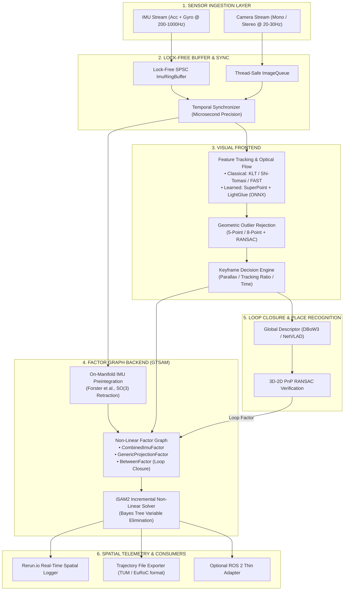
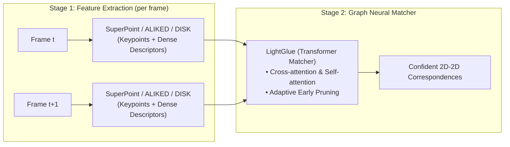

# NeuroVIO: Technical Specification & Implementation Guide

> **High-Performance Hybrid Visual-Inertial State Estimation & Spatial Perception Engine**  
> **Language:** C++20 | **Core Stack:** GTSAM, Sophus, Eigen3, OpenCV, ONNX Runtime, Rerun.io

---

## 1. Executive Summary & Vision

**NeuroVIO** is a production-grade, modular, real-time **Visual-Inertial Odometry (VIO) and Spatial SLAM system** written in modern C++20. It combines the mathematical rigor of classical non-linear factor graph optimization (*GTSAM / iSAM2*) and Lie group theory ($\mathfrak{so}(3), \mathfrak{se}(3)$) with modern deep learning perception frontends (*SuperPoint, LightGlue, Depth-Anything*) and state-of-the-art spatial telemetry via *Rerun.io*.

### Primary Engineering Goals
1. **Algorithmic Accuracy:** Sub-10 cm Absolute Trajectory Error (ATE RMSE) on the standard *EuRoC MAV* benchmark.
2. **Real-Time Deterministic Latency:** Processing pipeline running at $\ge 30\text{ Hz}$ on standard CPU/GPU hardware with $< 30\text{ ms}$ per-frame budget.
3. **Lock-Free Concurrency:** Zero-lock synchronization between high-rate IMU ingestion (200–1000 Hz) and visual optimization (20–60 Hz).
4. **Clean Architecture:** 100% pure C++ core library (`libneurovio.so`) free from heavyweight robotics middleware, with clean decoupling for datasets (EuRoC), optional ROS 2 wrappers, and Python bindings.
5. **Interview-Grade Codebase:** Comprehensive unit tests, continuous integration, AddressSanitizer/ThreadSanitizer compliance, and explicit mathematical documentation for every Jacobian and factor.

---

## 2. System Architecture



---

## 3. Mathematical Formulation & State Definition

### 3.1. Navigation State Vector
At keyframe time $t_k$, the navigation state $\mathbf{x}_k$ is defined on the manifold:
$$\mathbf{x}_k = \left[ \mathbf{R}_k, \mathbf{p}_k, \mathbf{v}_k, \mathbf{b}_k^a, \mathbf{b}_k^g \right] \in SO(3) \times \mathbb{R}^3 \times \mathbb{R}^3 \times \mathbb{R}^3 \times \mathbb{R}^3$$

* $\mathbf{R}_k \in SO(3)$: Orientation of the IMU body frame relative to the world frame.
* $\mathbf{p}_k \in \mathbb{R}^3$: Position of the IMU in the world frame.
* $\mathbf{v}_k \in \mathbb{R}^3$: Velocity of the IMU in the world frame.
* $\mathbf{b}_k^a \in \mathbb{R}^3$: Accelerometer bias (modeled as random walk).
* $\mathbf{b}_k^g \in \mathbb{R}^3$: Gyroscope bias (modeled as random walk).

### 3.2. IMU Kinematics on $SO(3)$ Manifold
Raw IMU measurements at timestamp $t \in [t_k, t_{k+1}]$:
$$\tilde{\boldsymbol{\omega}}(t) = \boldsymbol{\omega}(t) + \mathbf{b}^g(t) + \boldsymbol{\eta}^{gd}(t)$$
$$\tilde{\mathbf{a}}(t) = \mathbf{R}^\top(t) \left( \mathbf{a}(t) - \mathbf{g} \right) + \mathbf{b}^a(t) + \boldsymbol{\eta}^{ad}(t)$$

### 3.3. IMU Preintegration Formulation (Forster et al.)
To avoid re-integrating high-rate IMU samples every time linearizations change in the optimizer, we integrate measurements in the local frame of keyframe $k$:
$$\Delta \mathbf{R}_{ij} = \prod_{k=i}^{j-1} \text{Exp}\left( (\tilde{\boldsymbol{\omega}}_k - \mathbf{b}_i^g) \Delta t \right)$$
$$\Delta \mathbf{v}_{ij} = \sum_{k=i}^{j-1} \Delta \mathbf{R}_{ik} (\tilde{\mathbf{a}}_k - \mathbf{b}_i^a) \Delta t$$
$$\Delta \mathbf{p}_{ij} = \sum_{k=i}^{j-1} \left( \Delta \mathbf{v}_{ik} \Delta t + \frac{1}{2} \Delta \mathbf{R}_{ik} (\tilde{\mathbf{a}}_k - \mathbf{b}_i^a) \Delta t^2 \right)$$

First-order Taylor expansions update these preintegrated terms when biases update ($\mathbf{b} \leftarrow \bar{\mathbf{b}} + \delta \mathbf{b}$) without re-looping raw IMU data:
$$\Delta \mathbf{R}_{ij}(\mathbf{b}_i^g) \approx \Delta \mathbf{R}_{ij}(\bar{\mathbf{b}}_i^g) \text{Exp}\left( \frac{\partial \Delta \mathbf{R}_{ij}}{\partial \mathbf{b}^g} \delta \mathbf{b}_i^g \right)$$

### 3.4. Visual Reprojection Factor
Given camera calibration matrix $\mathbf{K}$ and camera-to-IMU extrinsics $\mathbf{T}_{C}^B = (\mathbf{R}_{C}^B, \mathbf{p}_{C}^B)$, the predicted pixel location of 3D landmark $\mathbf{L}_l \in \mathbb{R}^3$ seen from camera pose $\mathbf{T}_{k} = (\mathbf{R}_k, \mathbf{p}_k)$ is:
$$\mathbf{z}_{pred} = \pi \left( \mathbf{K} \left( \mathbf{R}_C^B \right)^\top \left( \mathbf{R}_k^\top (\mathbf{L}_l - \mathbf{p}_k) - \mathbf{p}_C^B \right) \right)$$
The residual cost minimized in the factor graph:
$$r_{proj} = \| \mathbf{z}_{meas} - \mathbf{z}_{pred} \|_{\boldsymbol{\Sigma}_{cam}}^2$$

---

## 4. Directory Structure & Modular Breakdown

```text
NeuroVIO/
├── .devcontainer/
│   └── devcontainer.json              # VSCode / Cursor Dev Container specification
├── docker/
│   ├── Dockerfile                     # Multi-stage reproducible build (Ubuntu 24.04 + Clang 18 + CUDA)
│   └── docker-compose.yml             # Local run and Rerun telemetry port forwarding
├── CMakeLists.txt
├── README.md
├── LICENSE
├── .gitignore
├── .clang-format
│
├── include/
│   └── neurovio/
│       ├── common/
│       │   ├── types.hpp              # Eigen typedefs, NavState, CameraModels
│       │   ├── lie_algebra.hpp        # Sophus SO(3)/SE(3) helper functions & Jacobians
│       │   ├── timestamps.hpp         # Timestamp utilities & nanosecond conversions
│       │   └── ring_buffer.hpp        # Lock-free SPSC circular buffer
│       ├── sensors/
│       │   ├── imu_data.hpp           # ImuMeasurement struct & calibration parameters
│       │   ├── camera_data.hpp        # Frame struct, stereo pairs, camera intrinsics
│       │   └── euroc_loader.hpp       # High-performance zero-copy EuRoC dataset reader
│       ├── frontend/
│       │   ├── feature_tracker.hpp    # Abstract tracker base class
│       │   ├── klt_tracker.hpp        # Classical Shi-Tomasi + Lucas-Kanade pyramid flow
│       │   ├── onnx_superpoint.hpp    # Learned feature detector (SuperPoint via ONNX)
│       │   ├── onnx_lightglue.hpp     # Learned feature matcher (LightGlue via ONNX)
│       │   └── keyframe_selector.hpp  # Parallax and tracking health heuristics
│       ├── backend/
│       │   ├── imu_preintegrator.hpp  # GTSAM PreintegratedCombinedMeasurements wrapper
│       │   ├── factor_graph.hpp       # Factor graph manager & iSAM2 interface
│       │   ├── landmark_manager.hpp   # 3D landmark triangulation & lifetime management
│       │   └── marginalization.hpp    # Sliding window marginalization & Schur complement
│       ├── loop_closure/
│       │   ├── place_recognition.hpp  # DBoW3 vocabulary search / NetVLAD interface
│       │   └── pnp_verifier.hpp       # Epipolar & PnP RANSAC geometric loop verification
│       ├── visualization/
│       │   └── rerun_logger.hpp       # Rerun.io C++ SDK spatial logging & telemetry
│       └── vio_pipeline.hpp          # Top-level coordinator tying threads together
│
├── src/                               # Corresponding .cpp implementations
│   ├── common/
│   ├── sensors/
│   ├── frontend/
│   ├── backend/
│   ├── loop_closure/
│   ├── visualization/
│   └── vio_pipeline.cpp
│
├── apps/
│   ├── run_euroc.cpp                  # CLI executable to run and record EuRoC sequences
│   └── benchmark_all.cpp              # Batch benchmark runner across all 11 EuRoC datasets
│
├── tests/                             # Unit tests with GoogleTest (GTest)
│   ├── test_lie_algebra.cpp           # Log/Exp maps, perturbation Jacobians
│   ├── test_imu_preintegration.cpp    # Integration over simulated trajectory
│   ├── test_feature_tracker.cpp       # Optical flow tracking verification
│   └── test_factor_graph.cpp          # Non-linear solver convergence test
│
└── scripts/
    ├── download_euroc.sh              # Automatic download script for EuRoC sequences
    ├── evaluate_evo.py                # Automated ATE/RPE evaluation script via evo
    └── export_onnx_models.py          # PyTorch to ONNX exporter for SuperPoint & LightGlue
```

---

## 5. Development Roadmap (Phases 1 to 5)

### Phase 1: Core Mathematical Foundation & Sensor Ingestion (Weeks 1–3)
* [ ] Setup CMake build system with strict warnings (`-Wall -Wextra -Wpedantic`), `GTest`, and `clang-format`.
* [ ] Configure native Clang 18 toolchain and containerized multi-stage `Dockerfile` / `.devcontainer`.
* [ ] Implement `neurovio::common::LieAlgebra` utilities wrapping `Sophus` and `Eigen3`.
* [ ] Implement thread-safe `neurovio::common::RingBuffer` for lock-free IMU queuing.
* [ ] Build `neurovio::sensors::EuRoCLoader` to parse image timestamps, stereo streams, and 200 Hz IMU CSVs.
* [ ] Write unit tests for Lie algebra log/exp maps, interpolation, and dataset parsing.

### Phase 2: IMU Preintegration & Dead-Reckoning Baseline (Weeks 4–5)
* [ ] Implement `neurovio::backend::ImuPreintegrator` utilizing GTSAM's on-manifold preintegration.
* [ ] Build a standalone IMU dead-reckoning test pipeline.
* [ ] Integrate **Rerun.io C++ SDK** to stream 3D coordinate frames, raw acceleration/gyro curves, and dead-reckoned trajectory in real-time.
* [ ] Verify IMU covariance propagation and bias drift visualization.

### Phase 3: Visual Frontend & 2D-3D Geometry (Weeks 6–8)
* [ ] Implement classical `neurovio::frontend::KltTracker`:
  * Corner detection: Shi-Tomasi / FAST with grid-based spatial bucketing (even feature distribution).
  * Feature tracking: Lucas-Kanade optical flow (`cv::calcOpticalFlowPyrLK`) with forward-backward consistency check.
* [ ] Outlier rejection via Fundamental Matrix / Essential Matrix RANSAC.
* [ ] Implement two-view triangulation (DLT / Midpoint) to generate initial 3D landmark point clouds.
* [ ] Stream feature tracks and triangulated point clouds to Rerun.io.

### Phase 4: Full Factor Graph Backend & VIO Integration (Weeks 9–12)
* [ ] Construct the central GTSAM factor graph:
  * State initialization (gravity alignment from initial stationary IMU period).
  * Insertion of `CombinedImuFactor` between consecutive keyframes.
  * Insertion of `GenericProjectionFactor<Pose3, Point3, Cal3_S2>` for tracked landmarks.
* [ ] Implement online marginalization / incremental optimization using `gtsam::iSAM2`.
* [ ] Benchmark full VIO trajectory on `EuRoC MH_01_easy` against Ground Truth.
* [ ] Run `evo_ape` to verify ATE RMSE $< 0.15\text{ m}$.

### Phase 5: Loop Closure, Neural Features & Performance Profiling (Weeks 13–16)
* [ ] Implement keyframe database with `DBoW3` bag-of-words / global descriptor matching.
* [ ] Geometric verification with PnP RANSAC and injection of `BetweenFactor<Pose3>` loop closures.
* [ ] (Neural Tracking Step) Add `neurovio::frontend::OnnxSuperPoint` (or `OnnxALIKED`) and `OnnxLightGlue` using ONNX Runtime C++.
* [ ] Profile and eliminate heap allocations in hot paths using **Tracy Profiler**.
* [ ] Setup GitHub Actions CI for multi-compiler build (Clang 16+, GCC 12+) and ARM64 cross-compilation.

---

## 6. Target Benchmarks & Verification Plan

### Automated Evaluation Matrix (EuRoC MAV)
Every pull request and major milestone is automatically validated using `scripts/evaluate_evo.py`:

| Dataset Sequence | Target ATE RMSE (VIO Only) | Target ATE RMSE (+ Loop Closure) | Max Frontend Latency | Max Backend Latency |
| :--- | :---: | :---: | :---: | :---: |
| `MH_01_easy` | $< 0.12\text{ m}$ | $< 0.04\text{ m}$ | $< 8\text{ ms}$ | $< 15\text{ ms}$ |
| `MH_02_easy` | $< 0.12\text{ m}$ | $< 0.04\text{ m}$ | $< 8\text{ ms}$ | $< 15\text{ ms}$ |
| `MH_03_medium` | $< 0.18\text{ m}$ | $< 0.06\text{ m}$ | $< 9\text{ ms}$ | $< 18\text{ ms}$ |
| `MH_04_difficult` | $< 0.25\text{ m}$ | $< 0.08\text{ m}$ | $< 10\text{ ms}$ | $< 20\text{ ms}$ |
| `V1_01_easy` | $< 0.09\text{ m}$ | $< 0.03\text{ m}$ | $< 8\text{ ms}$ | $< 15\text{ ms}$ |
| `V1_02_medium` | $< 0.14\text{ m}$ | $< 0.05\text{ m}$ | $< 9\text{ ms}$ | $< 18\text{ ms}$ |
| `V2_01_easy` | $< 0.08\text{ m}$ | $< 0.03\text{ m}$ | $< 8\text{ ms}$ | $< 15\text{ ms}$ |

---

## 7. Technical Interview Defense Cheatsheet

When defending this repository in interviews with hiring managers and staff engineers at **Apple, Skydio, Meta, Wing, or NVIDIA**, be prepared to answer:

1. **Why Factor Graphs over Extended Kalman Filters (MSCKF)?**
   * *Answer:* Iterative re-linearization of past states, exact handling of non-linear manifold constraints without premature linearization errors, and natural integration of delayed loop-closure measurements.
2. **What are the unobservable directions in Monocular vs. Stereo VIO?**
   * *Answer:* Monocular VIO has 4 unobservable degrees of freedom (3 global position coordinates + 1 rotation around gravity vector / yaw). Gravity direction (roll and pitch) and metric scale become observable through accelerometer excitation. Stereo VIO has fixed baseline scale, leaving only 4 DOF unobservable.
3. **How do you handle IMU bias updates without recomputing integrals?**
   * *Answer:* First-order Taylor series expansion using precomputed Jacobian matrices $\frac{\partial \Delta \mathbf{R}}{\partial \mathbf{b}^g}$, $\frac{\partial \Delta \mathbf{v}}{\partial \mathbf{b}}$, $\frac{\partial \Delta \mathbf{p}}{\partial \mathbf{b}}$ calculated during the initial integration step on the Lie algebra tangent space.
4. **How do you prevent thread starvation between IMU (high-rate) and Visual Optimization (lower-rate)?**
   * *Answer:* IMU ingestion runs on a dedicated high-priority thread pushing to a lock-free Single-Producer Single-Consumer (SPSC) ring buffer. The optimization backend reads slices of IMU data synchronously based on keyframe image timestamps without holding locks on the ingestion thread.

---

## 8. Toolchain, Build Infrastructure & Licensing Matrix

### 8.1. Compiler & Toolchain Standards
* **Primary Compiler:** Clang 18+ (`clang++-18`) with `-std=c++20`.
* **Sanitizers:** AddressSanitizer (`-fsanitize=address,undefined`) and ThreadSanitizer (`-fsanitize=thread`) enabled via CMake presets.
* **Static Analysis & Formatting:** `clang-tidy-18` and `clang-format-18` enforced in CI.
* **Linker:** `lld` (LLVM Linker) for sub-second incremental link times.

### 8.2. Dual Development Environment Strategy (Native + Docker)
1. **Native Linux Development (Host):**
   * Maximum performance, zero virtualization overhead, and native debugging with `lldb` and Tracy Profiler.
   * Compilers and toolchains: `sudo apt install -y clang-18 clang-tools-18 clang-format-18 clang-tidy-18 lldb-18 lld-18`.
2. **Containerized Build (Docker & Dev Containers):**
   * Guarantees 100% reproducible environments across developer machines and GitHub Actions CI.
   * Maps ports `9876` (Rerun.io telemetry viewer) and `8086` (Tracy Profiler) back to the host machine.

### 8.3. Neural Perception Architecture & Intellectual Property Matrix

In NeuroVIO, deep learning models operate in an explicit two-stage pipeline: **Feature Extraction (Detector + Descriptor)** followed by **Feature Matching**:



| Component | Model Role | License | Permissibility (Commercial vs Research) |
| :--- | :--- | :--- | :--- |
| **LightGlue** (ETH Zürich) | Feature Matcher | **Apache 2.0** | **Free for Academic & Commercial Use** |
| **SuperPoint** (Magic Leap) | Feature Detector & Descriptor | Magic Leap Research License | **Free for Research / Non-Commercial Only** |
| **ALIKED** (Zhao et al.) | Feature Detector & Descriptor | **BSD-3-Clause / Apache 2.0** | **Free for Academic & Commercial Use** |
| **DISK** (Tyszkiewicz et al.) | Feature Detector & Descriptor | **Apache 2.0** | **Free for Academic & Commercial Use** |
| **KLT / Shi-Tomasi** | Classical Optical Flow | **BSD / MIT (OpenCV)** | **Free for Academic & Commercial Use** |

> [!NOTE]
> NeuroVIO defines an abstract interface `neurovio::frontend::FeatureTracker` and `FeatureMatcher`. This allows swapping between classical KLT, **SuperPoint + LightGlue** (academic baseline), and **ALIKED + LightGlue** (commercial-ready license) without modifying the downstream backend or factor graph.

