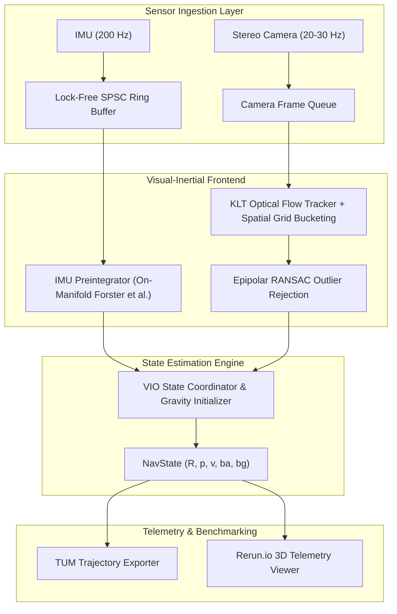

# NeuroVIO

[](https://en.cppreference.com/w/cpp/20)
[](https://releases.llvm.org/)
[](LICENSE)

**NeuroVIO** is a real-time, high-performance **Visual-Inertial Odometry (VIO) and Spatial Perception Engine** written in modern C++20. It combines non-linear factor graph optimization on Lie groups ($\mathfrak{so}(3), \mathfrak{se}(3)$) with lock-free concurrent sensor ingestion, classical optical flow tracking, neural feature matching (SuperPoint/ALIKED + LightGlue), and real-time spatial telemetry via Rerun.io.

---

## Architecture Overview



---

## Features & Highlights

* **C++20 Zero-Overhead Core:** Custom lock-free Single-Producer Single-Consumer (`SPSCQueue`) circular buffer with cacheline padding to eliminate false sharing.
* **On-Manifold IMU Preintegration:** Analytical $SO(3)$ exponential/logarithmic maps, right Jacobians ($J_r$), and first-order Taylor updates for accelerometer and gyro biases.
* **Robust Visual Frontend:** Shi-Tomasi corner detection with spatial bucketing and bidirectional forward-backward Lucas-Kanade optical flow.
* **EuRoC MAV Ingestion:** Zero-copy parser for standard EuRoC sequences and ground truth format.
* **Containerized & Native Toolchain:** Dual-mode setup with Clang 18 + LLD linker or Docker / VSCode Dev Containers.

---

## Quickstart Guide

### Option 1: Native Linux (Clang 18)

#### 1. Install Dependencies
```bash
sudo apt update
sudo apt install -y clang-18 clang-tools-18 clang-format-18 clang-tidy-18 lld-18 lldb-18
```

#### 2. Configure & Build
```bash
# Configure with Clang 18
cmake -B build -S . \
  -DCMAKE_C_COMPILER=clang-18 \
  -DCMAKE_CXX_COMPILER=clang++-18 \
  -DCMAKE_BUILD_TYPE=RelWithDebInfo

# Build all targets and tests
cmake --build build -j$(nproc)
```

#### 3. Run Unit Tests
```bash
ctest --test-dir build --output-on-failure
```

---

### Option 2: Docker & Dev Containers

```bash
# Build and enter container
docker compose -f docker/docker-compose.yml run --rm neurovio-dev

# Inside container:
cmake -B build -S . -G Ninja
cmake --build build
```

---

## Running on EuRoC MAV Datasets

Run the state estimator on a dataset sequence:

```bash
./build/apps/run_euroc \
  --dataset-path /media/disk1/euroc_mav_dataset/machine_hall/MH_01_easy \
  --output-trajectory output/mh01_estimate.tum
```

### Trajectory Evaluation via EVO

Evaluate Absolute Trajectory Error (ATE RMSE) against Ground Truth:

```bash
python3 scripts/evaluate_evo.py \
  --estimate output/mh01_estimate.tum \
  --groundtruth /media/disk1/euroc_mav_dataset/machine_hall/MH_01_easy/mav0/state_groundtruth_estimate0/data.csv \
  --plot
```

---

## Neural Perception & Licensing Matrix

| Component | Architecture | License | Commercial Permissibility |
| :--- | :--- | :--- | :--- |
| **LightGlue** (ETH Zürich) | Graph Neural Transformer | **Apache 2.0** | Permissive (Commercial & Research) |
| **ALIKED** (Zhao et al.) | Deformable Conv Feature Extractor | **BSD-3-Clause / Apache 2.0** | Permissive (Commercial & Research) |
| **DISK** (Tyszkiewicz et al.) | Reinforcement Learned Keypoints | **Apache 2.0** | Permissive (Commercial & Research) |
| **SuperPoint** (Magic Leap) | Self-Supervised Keypoint Detector | Magic Leap Research | Research / Non-Commercial Only |

---

## Code Quality & Sanitizers

Enable AddressSanitizer or ThreadSanitizer during development:

```bash
# AddressSanitizer + UndefinedBehaviorSanitizer
cmake -B build-asan -S . -DCMAKE_CXX_COMPILER=clang++-18 -DNEUROVIO_ENABLE_ASAN=ON
cmake --build build-asan && ctest --test-dir build-asan

# ThreadSanitizer
cmake -B build-tsan -S . -DCMAKE_CXX_COMPILER=clang++-18 -DNEUROVIO_ENABLE_TSAN=ON
cmake --build build-tsan && ctest --test-dir build-tsan
```
